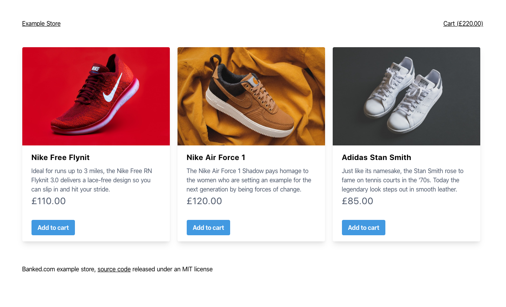

# 🛍 Example Store

[](https://heroku.com/deploy?template=https://github.com/banked/example-store)

> A [Nuxt.js](https://nuxtjs.org/) powered example storefront demonstrating the Banked API that is currently [deployed to Heroku](https://banked-example-store.herokuapp.com/)



This dummy ecommerce store uses shoes as a product, it's purpose is to demonstrate an implementation of Banked's hosted checkout, used for account to account payments. You can add products to a basket and checkout using Banked's API.

If you want to see the Banked specific parts checkout `./server/api.js` for creating the checkout URL on the backend that the stores redirects people to and `./test/server/api.spec.js` for tests of the implementation. 

## Build Setup

``` bash
# install dependencies
$ npm install

# serve with hot reload at localhost:3000
$ npm run dev

# build for production and launch server
$ npm run build
$ npm run start

# generate static project
$ npm run generate
```

For detailed guide on how things fit together, check out the [Nuxt.js docs](https://nuxtjs.org).

## Deploying the store

The store is automatically deployed to [Heroku](https://store.banked-demo.app/) when a commit is pushed to the master branch.

### Environment variables

There are several environment variables that need to be set on the server to be able to make payments. You can add them to the checked in `./.env` file and they'll be automatically pulled and used by the backend.

## 📸 Photo credits

All of the product images used in the demo store are sourced from [Unsplash](https://unsplash.com/). The individual image credits are:

* [REVOLT](https://unsplash.com/@revolt?utm_source=unsplash&utm_medium=referral&utm_content=creditCopyText) for the [photo of the red sneaker](https://unsplash.com/photos/164_6wVEHfI)
* [Maksim Larin](https://unsplash.com/@maksimcul8r?utm_source=unsplash&utm_medium=referral&utm_content=creditCopyText) for the [photo of the tan sneaker](https://unsplash.com/photos/NOpsC3nWTzY)
* [MNZ](https://unsplash.com/@mnzoutfits?utm_source=unsplash&utm_medium=referral&utm_content=creditCopyText) for the [photo of the white sneakers](https://unsplash.com/photos/BeClz11lyXY)
